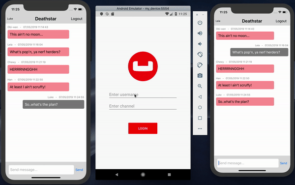
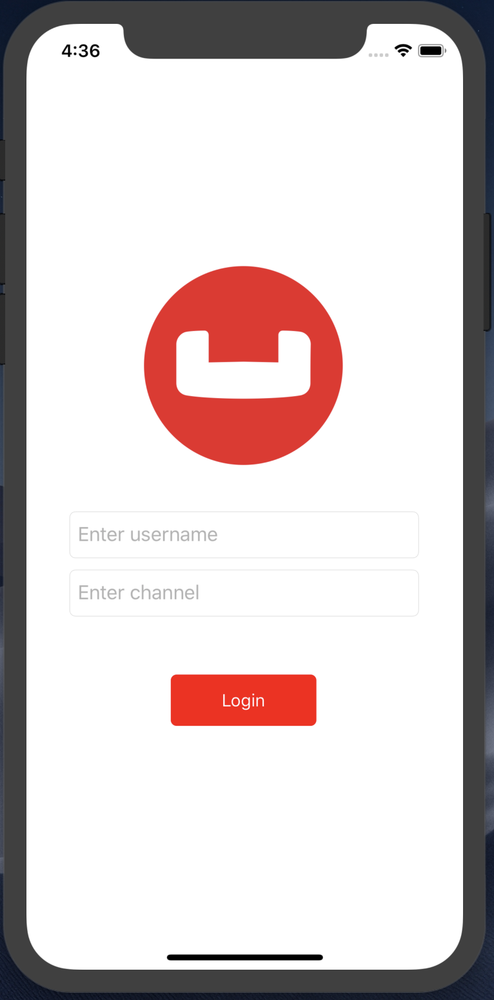
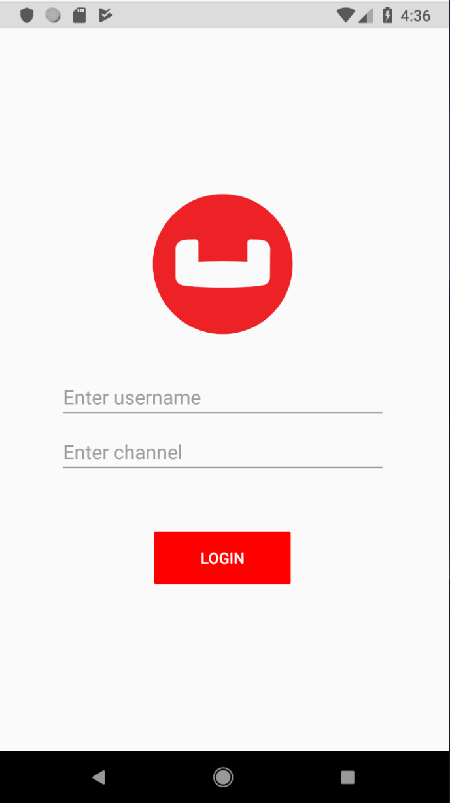
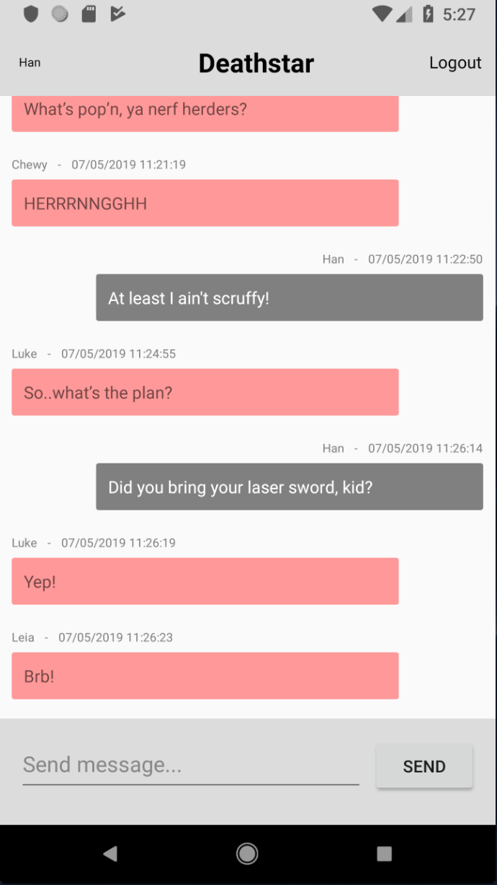
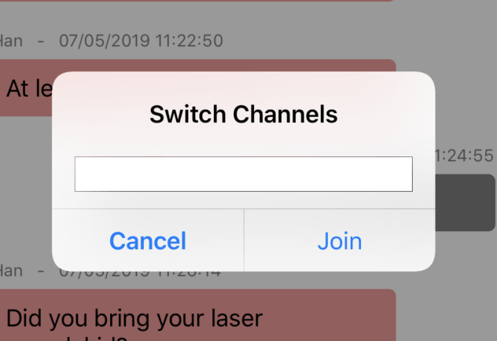

# Chatbase
Chatbase is a simple (mobile) chat app powered by an embedded [Couchbase Lite](https://www.couchbase.com/products/lite) database, the synchronization enginee of [Sync Gateway](https://www.couchbase.com/products/sync-gateway), and a distributed [Couchbase Server](https://www.couchbase.com/products/server) database.



# Table of Contents
1. [Couchbase Mobile Overview](#overview)
2. [Setting up server-side components](#installation)
    1. [Sync Gateway](#installation-sg)
    2. [Couchbase Server](#installation-cbs)
3. [Running the solutions](#running) 
4. [Support](#support)

## Couchbase Mobile Overview <a name="overview"></a>

Couchbase Mobile brings the power of NoSQL to the edge and is comprised of three components:

[Couchbase Lite](https://docs.couchbase.com/couchbase-lite/2.5/introduction.html), an embedded, NoSQL JSON Document Style database for your mobile apps

[Sync Gateway](https://docs.couchbase.com/sync-gateway/current/introduction.html), an internet-facing synchronization mechanism that securely syncs data between mobile clients and server, and

[Couchbase Server](https://docs.couchbase.com/server/6.0/introduction/intro.html), a highly scalable, distributed NoSQL database platform

## Setting up server-side components <a name="installation"></a>

Chatbase uses Couchbase's Sync Gateway and Server solutions. Both components can be installed locally, on on-premisis servers, and/or within the cloud. For this demo we'll be installing everything locally for testing.

### Sync Gateway <a name="installation-sg"></a>

Sync Gateway is the synchronization server in a Couchbase Mobile deployment.

Sync Gateway is designed to provide data synchronization for large-scale interactive web, mobile, and IoT applications. Commonly used features include:

* User authentication, ensuring that only authorized users can connect to Sync Gateway (see user [authentication guide](https://docs.couchbase.com/sync-gateway/current/authentication.html)).

* Access Control, guaranteeing that only relevant documents are synced. Sync Gateway accomplishes this by examining document and applying business logic to decide whether to assign the documents to channels. Access control and ensuring that only relevant documents are synced are achieved through the use of channels and the [Sync Function](https://docs.couchbase.com/sync-gateway/current/sync-function-api.html).

#### Installation

To install Sync Gateway please follow the instructions [here](https://docs.couchbase.com/sync-gateway/current/getting-started.html).

#### Running

To start using Sync Gateway execute the following command. 

```bash
~/Downloads/couchbase-sync-gateway/bin/sync_gateway ~/path/to/basic-sync-function.json
```

**Note:** "basic-sync-function.json" is included within the repo [here](https://github.com/couchbaselabs/Chatbase/blob/master/src/Server/basic-sync-function.json).

#### Settings

To learn more about how to modify the Sync Gateway configuration file please see the documentation [here](https://docs.couchbase.com/sync-gateway/current/config-properties.html).

### Couchbase Server <a name="installation-cbs"></a>

Couchbase Server is an open source, distributed, NoSQL document-oriented engagement database. It exposes a fast key-value store with managed cache for sub-millisecond data operations, purpose-built indexers for fast queries and a powerful query engine for executing SQL-like queries. For mobile and Internet of Things environments Couchbase also runs natively on-device and manages synchronization to the server.

Couchbase Server is specialized to provide low-latency data management for large-scale interactive web, mobile, and IoT applications. Common requirements that Couchbase Server was designed to satisfy include:

Unified Programming Interface

* Query
* Search
* Mobile and IoT
* Analytics
* Core database engine
* Scale-out architecture
* Memory-first architecture
* Big data and SQL integrations
* Full-stack security
* Container and Cloud deployments
* High Availability

#### Installation

To install Couchbase Server please follow the instructions [here](https://docs.couchbase.com/server/6.0/getting-started/start-here.html).

**Note:** I advise installing Couchbase Server _manually_ to start. If you install using Docker you will need to ensure that both Sync Gateway and Couchbase Server are running on the same Docker Host, and then you'll need to configure accordingly. You can find more instructions using Docker [here](https://blog.couchbase.com/using-docker-with-couchbase-mobile/).

#### Running

Once Couchbase Server has been installed simply navigate to where it has been installed and start "Couchbase Server".

To start Couchbase Server using Docker please see the documentation [here](https://docs.couchbase.com/server/6.0/getting-started/do-a-quick-install.html).

#### Admin Portal

Couchbase Server can be accessed using
 * [CLI](https://docs.couchbase.com/server/6.0/cli/cli-intro.html)
 * [API](https://docs.couchbase.com/server/6.0/rest-api/rest-intro.html)
 * An [administration (web) portal](https://docs.couchbase.com/server/6.0/getting-started/look-at-the-results.html)

When Couchbase Server has been started you'll be able to navigate directly to the admin portal at http://localhost:8091.

## Running the solutions <a name="running"></a>

Chatbase has two .NET solutions:

* [Chatbase.API](https://github.com/couchbaselabs/Chatbase/tree/master/src/Server/Chatbase.API): A .NET Core Web API solution used for communicating with Sync Gateway via the [Admin API](https://docs.couchbase.com/sync-gateway/2.5/admin-rest-api.html).

* [Chatbase](https://github.com/couchbaselabs/Chatbase/tree/master/src/Client/Chatbase): A Xamarin(.Forms) based solution containing several porjects

You will need to build and run the Chatbase.API solution before attempting to use the Chatbase mobile solution. You will also need to keep the Chatbase.API solution running. 

Users are able to log into the app simply by entering a name and a Sync Gateway [channel](https://docs.couchbase.com/sync-gateway/current/data-routing.html#introduction-to-channels).

<p>


</p>

After you've logged in you'll be taken to the channel's chat screen, and will be able to send messages.



</p>

You'll also be able to switch channels by tapping the navigation bar title, and entering in a new channel name.


 
